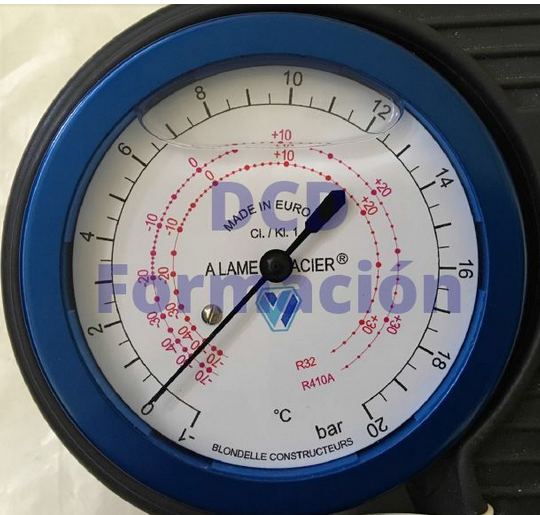
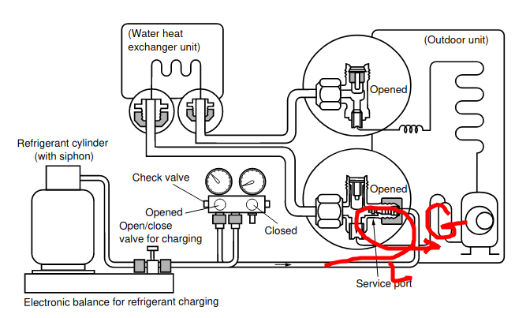
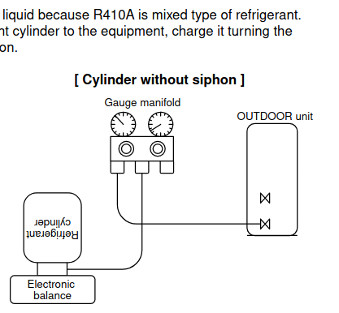
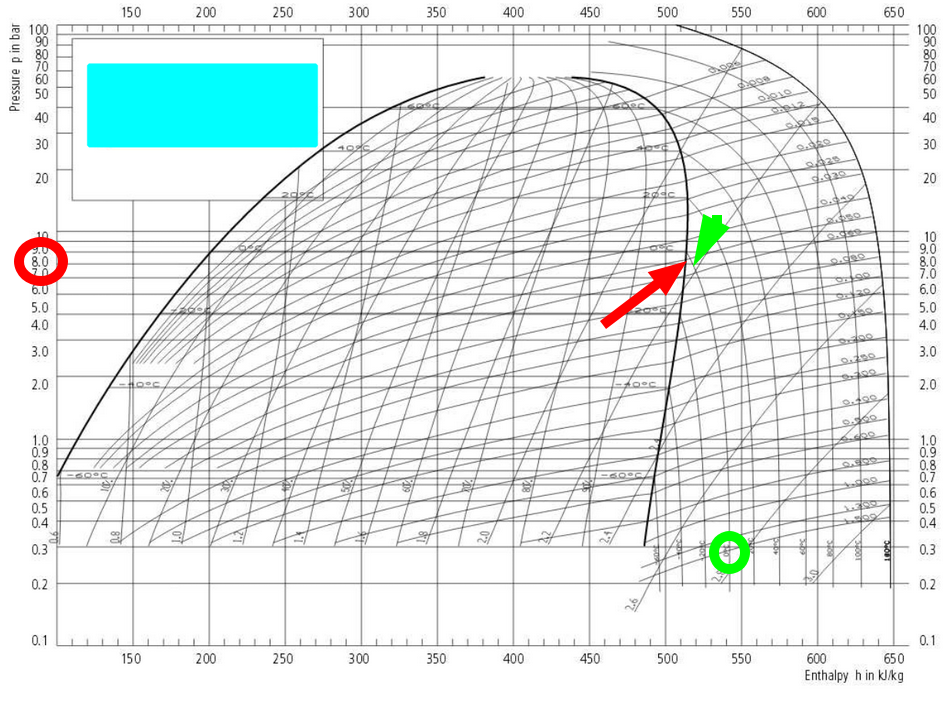

- [son practiacmente iguales el R32 y el 410,](#son-practiacmente-iguales-el-r32-y-el-410)
- [410A](#410a)
- [refrigeration cycle](#refrigeration-cycle)
- [recarga](#recarga)
- [R32](#r32)
- [Con manometro y termometro](#con-manometro-y-termometro)

## son practiacmente iguales el R32 y el 410,
solo que el R32 es ligeramente inflamable 

## 410A
[manual](https://www.toshibaclim.com/Portals/0/Documentation/Manuels%20produits/SM_N3KV2_07_GB.PDF)
## refrigeration cycle

tenemos qu emeter liquido, para que vayan bien dicueltos los dos compoentes del refreggerantge a la entrada del compresor de gas (riesgo de joderlo) por eso hay que abrir y cerrar (expansionando nosotros al recargar)

## recarga

enchufar la botella y meterle en la aspiracion del compresor arrancado en frei o a 16 100 psi minimo. 

## R32

[recarga](https://www.elaireacondicionado.com/articulos/carga-optima-de-gas-aire-acondicionado)

## Con manometro y termometro
Poner la maquina en frio 16 y ventilador al maximo.
y meterle liquido hasta los 8 +- 1 kg/cm2
Con el MANÓMETRO tendremos la temperatura de SATURACIÓN, Ts

Con el TERMÓMETRO de contacto la medida exterior, Tm, de entrada el compresor 

Deberia ser
Ts-Tm = 4

en el ejemplo representado son 2, un ppoco recalentado, esta bien, si fuera negativo habria humedad (dentro de la campana) que podria danar el compresor

