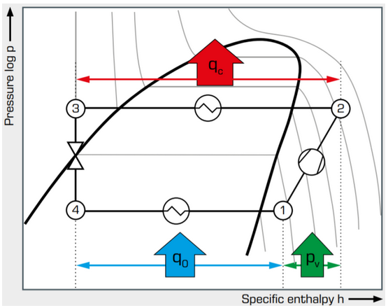
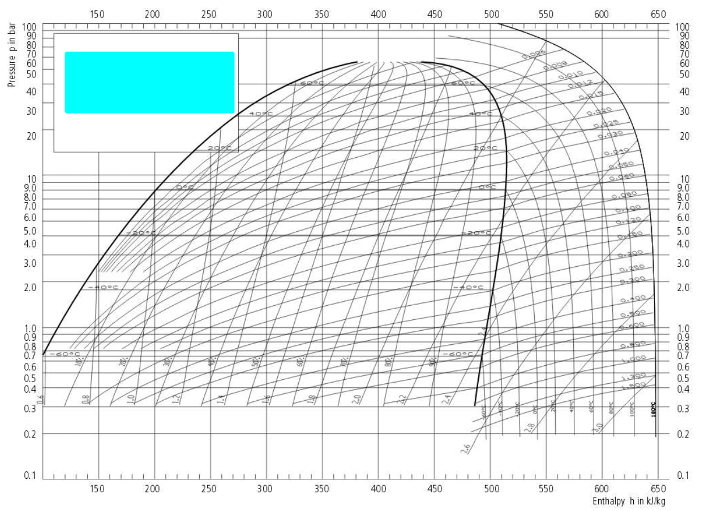

## 410A
[manual](https://www.toshibaclim.com/Portals/0/Documentation/Manuels%20produits/SM_N3KV2_07_GB.PDF)
## refrigeration cycle

tenemos qu emeter liquido, para que vayan bien dicueltos los dos compoentes del refreggerantge a la entrada del compresor de gas (riesgo de joderlo) por eso hay que abrir y cerrar (expansionando nosotros al recargar)

## recarga

## R32

[recarga](https://www.elaireacondicionado.com/articulos/carga-optima-de-gas-aire-acondicionado)
